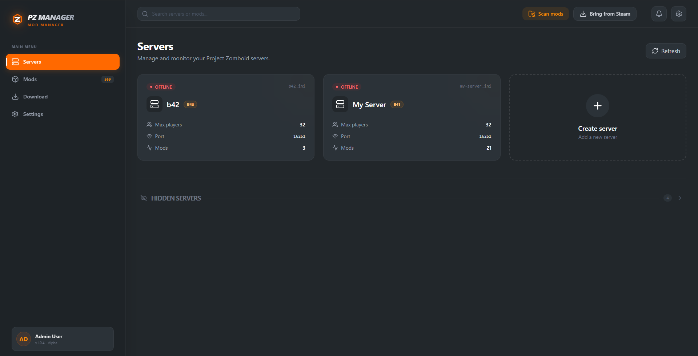
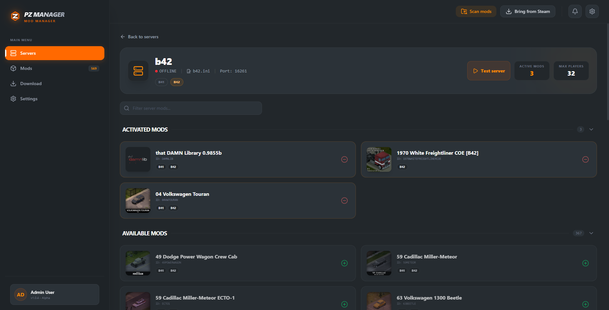
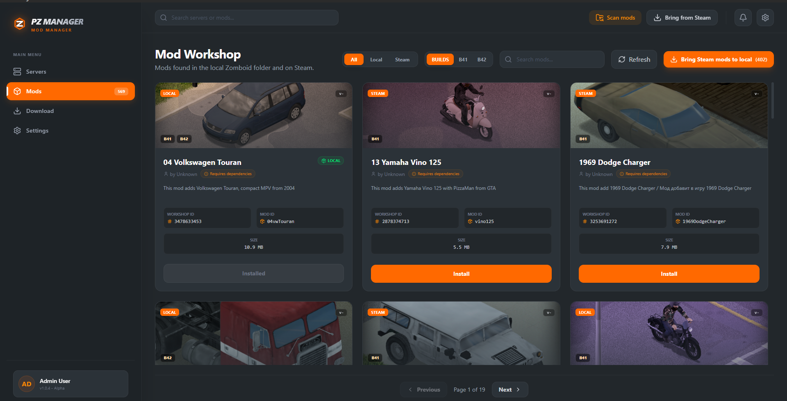
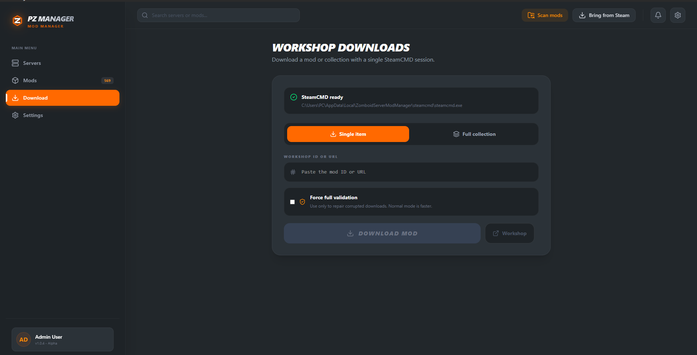
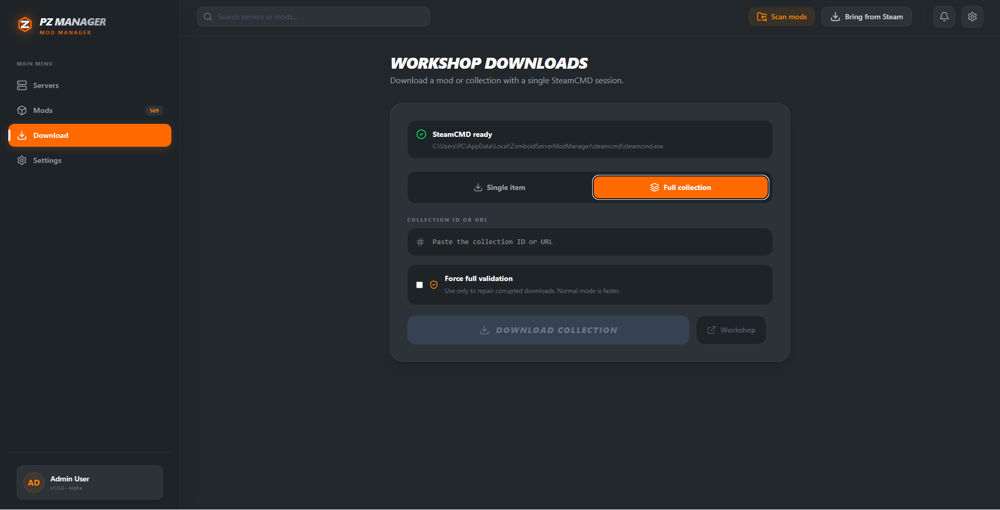
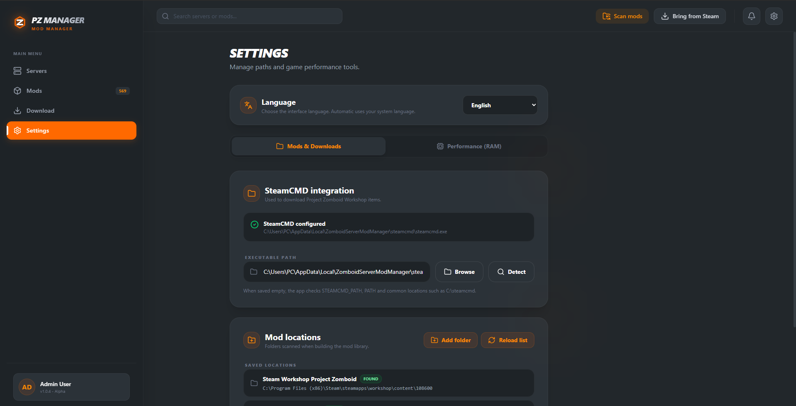
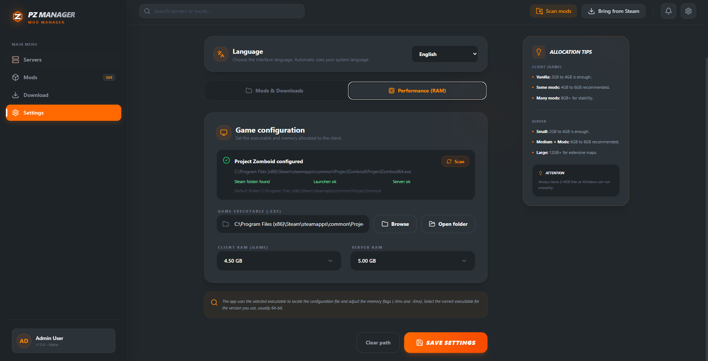
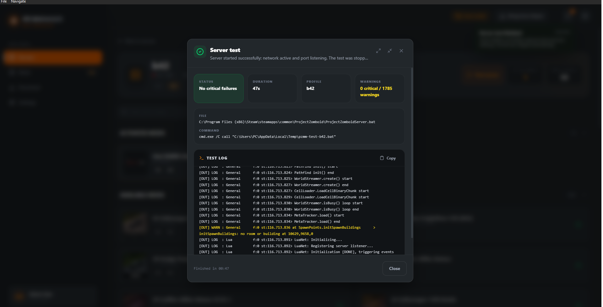
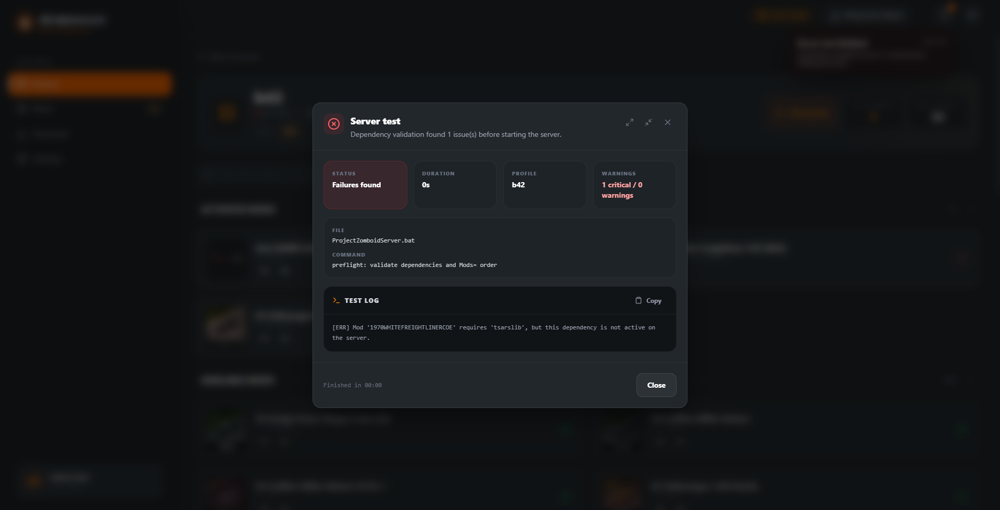

[**English**](README.md) | [Português (Brasil)](README.pt-BR.md)

<div align="center">

# PZ Manager

### Manage Project Zomboid multiplayer server mods without editing configuration files manually.

[](package.json)


</div>

---

## About

**PZ Manager** is a desktop application for organizing **Project Zomboid** server mods. It finds existing profiles, builds a cached library from local mods and Steam Workshop items, updates `.ini` files, and runs startup tests with real-time logs.

The application supports **Build 41** and **Build 42** profiles. Each server keeps its own build, mod list, and Workshop items.

## Version 0.3.0 Highlights

- Persistent backend cache for the mod library, reused by the server preflight.
- Faster refreshes by revalidating only changed mod packages.
- Full rescan action to clear the mod cache and rebuild the library.
- Settings open with the last known values while backend settings are refreshed.
- Local mod images load through Tauri's asset protocol instead of base64 payloads.

## Features

| Feature | What you can do |
| --- | --- |
| **Servers** | Create profiles, list existing servers, search, hide profiles, and clone lists between servers using the same build. |
| **B41 and B42** | Choose a build per profile, change versions with confirmation, and identify incompatible mods. |
| **Active mods** | Enable, disable, and reorder mods with automatic `.ini` updates. |
| **Dependencies** | Detect missing dependencies, install required items, and validate load order. |
| **Library** | Find local mods, Steam Workshop items, and mods stored in custom folders. |
| **Downloads** | Download individual mods or complete collections through SteamCMD with anonymous login. |
| **Diagnostics** | Test server startup, follow logs, and identify port conflicts. |
| **Settings** | Detect Project Zomboid and SteamCMD, adjust RAM, language, and monitored directories. |
| **Languages** | Use English or Brazilian Portuguese with automatic detection and instant switching. |

## B41 and B42 Support

Existing profiles without metadata continue to open as **B41**. New profiles let you choose between `B41` and `B42`.

Each library mod receives compatibility badges. Hybrid packages appear only once even when they provide variants for both builds.

B42 support preserves the versioned package structure:

```text
mods/
└── ExampleMod/
    ├── common/
    ├── 42/
    │   └── mod.info
    └── 42.17/
        └── mod.info
```

When enabling mods:

- B41 profiles write the traditional Mod ID to `Mods=`.
- B42 profiles write the compatible variant ID.
- `WorkshopItems=` keeps unique Workshop IDs.
- Incompatible mods remain visible for manual removal.
- The test preflight blocks missing dependencies, invalid order, and incompatible mods.

## Library and SteamCMD

The application reads installed mods from `Zomboid/mods`, Steam libraries, and custom directories.

When moving a mod to the local folder, the complete package is copied. This preserves B41 variants, versioned B42 directories, shared `common` content, and the `.pzmm-workshop-id` marker.

Downloads accept a numeric Workshop ID or URL:

- Individual item or public collection.
- Per-item progress.
- Cancellation during download.
- Retry only failed items.
- Optional full validation for investigating corrupted files.
- Automatic library refresh when finished.

## Server Test

Diagnostics run a controlled startup and display logs in real time. Before starting, the application:

1. Validates active mods and dependencies.
2. Checks load order.
3. Checks compatibility with B41 or B42.
4. Searches for conflicts on configured ports.

B42 has a longer timeout because startup may take more time.

## Internationalization

The language can be changed in **Settings**:

- `Automatic`: uses `pt-BR` when the system language matches `pt-*`; otherwise uses English.
- `English`
- `Português (Brasil)`

The preference is saved to `settings.ini` and applied immediately.

| Layer | Implementation |
| --- | --- |
| React frontend | [`i18next`](https://www.i18next.com/) and [`react-i18next`](https://react.i18next.com/) |
| Rust backend and native menu | [`rust-i18n`](https://docs.rs/rust-i18n/latest/rust_i18n/) |
| Frontend catalog | `src/i18n/resources.ts` |
| Backend catalog | `src-tauri/locales/app.yml` |

## Getting Started

1. Open **Settings** and confirm that SteamCMD was found.
2. Check that the Project Zomboid executable was detected.
3. Choose your preferred language or keep automatic detection.
4. Add custom directories if you store mods outside the default folders.
5. Refresh the library.
6. Create a server and select its build and mods.
7. Review dependencies and run a startup test.

## Interface

<p align="center">
  <a href="docs/images/server.png"></a>
  <a href="docs/images/server-detail.png"></a>
</p>

<p align="center">
  <a href="docs/images/mods.png"></a>
  <a href="docs/images/download-mod.png"></a>
</p>

<p align="center">
  <a href="docs/images/download-collection.png"></a>
  <a href="docs/images/settings.png"></a>
</p>

<p align="center">
  <a href="docs/images/performance.png"></a>
  <a href="docs/images/server-test-success.png"></a>
</p>

<p align="center">
  <a href="docs/images/server-test-error.png"></a>
</p>

## Development

### Prerequisites

- Windows 10 or 11
- [Node.js](https://nodejs.org/) with npm
- [Rust](https://www.rust-lang.org/tools/install)
- [Tauri prerequisites for Windows](https://v2.tauri.app/start/prerequisites/)
- Project Zomboid installed to use all features

### Running Locally

```powershell
npm install
npm run tauri:dev
```

To work only on the interface:

```powershell
npm run dev
```

To generate a desktop build:

```powershell
npm run tauri:build
```

### Validation

```powershell
npm run build
cd src-tauri
cargo test
cargo fmt --check
cd ..
git diff --check
```

## Technologies

| Layer | Technologies |
| --- | --- |
| Interface | React 19, TypeScript, and Vite 8 |
| Styling | Tailwind CSS 4 |
| Components and icons | Base UI, shadcn, and Lucide React |
| Desktop application | Tauri 2 |
| Local backend | Rust |
| Workshop downloads | SteamCMD |
| Internationalization | i18next, react-i18next, and rust-i18n |

## Project Structure

```text
.
├── resources/             # Example files and bundled resources
├── src/                   # React interface, components, types, and frontend catalogs
├── src-tauri/
│   ├── locales/           # Backend rust-i18n catalogs
│   └── src/               # Rust backend and Tauri commands
├── package.json           # Frontend dependencies and scripts
├── README.pt-BR.md        # Brazilian Portuguese documentation
└── README.md              # Main English documentation
```

## Current Status

The project is under active development and currently focused on Windows. Listed servers initially appear as offline; detailed diagnostics run when you execute the server test.

## License

This repository does not have a license file yet. Before reusing or redistributing the code, confirm the applicable terms with the project author.
