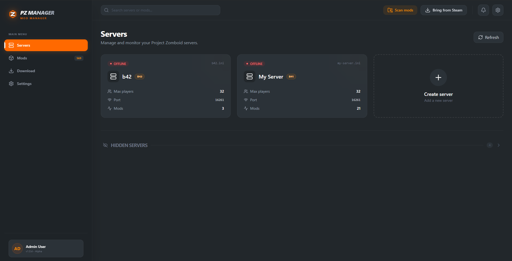
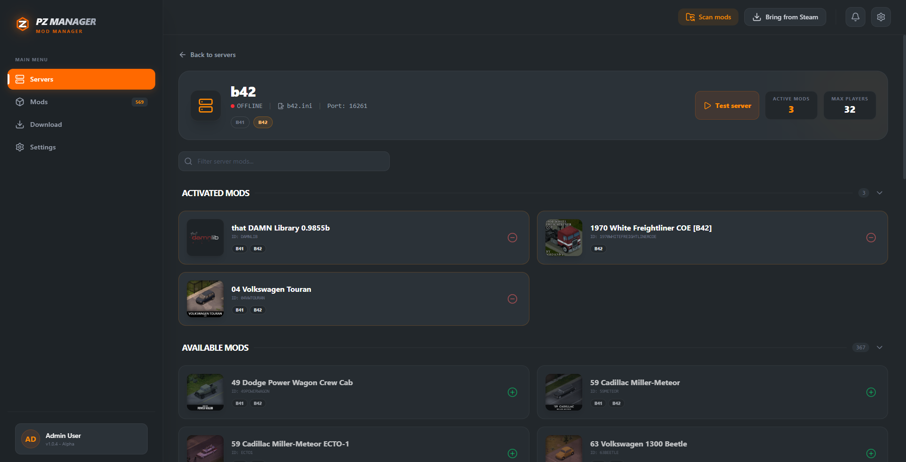
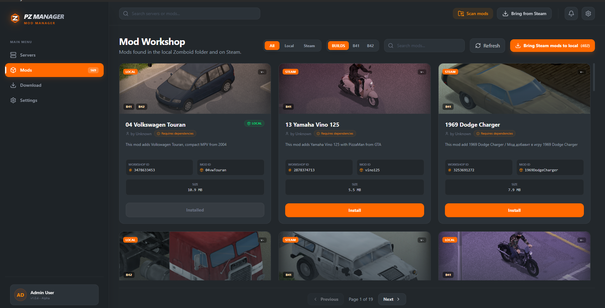
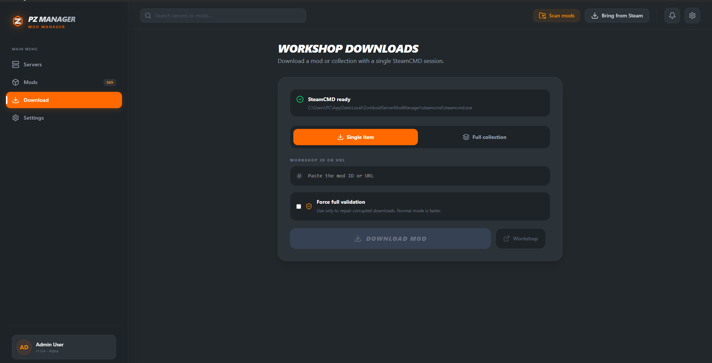
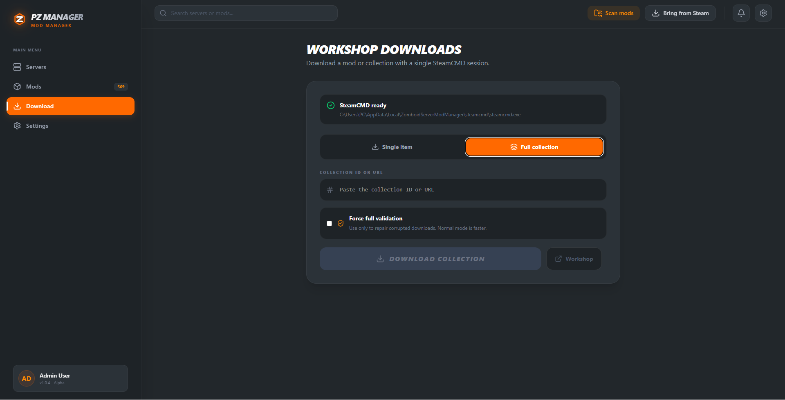
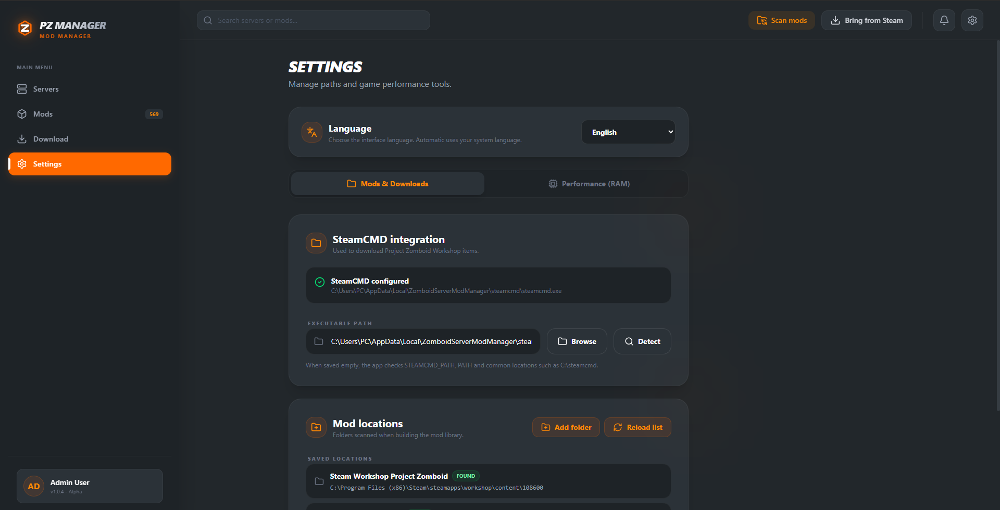
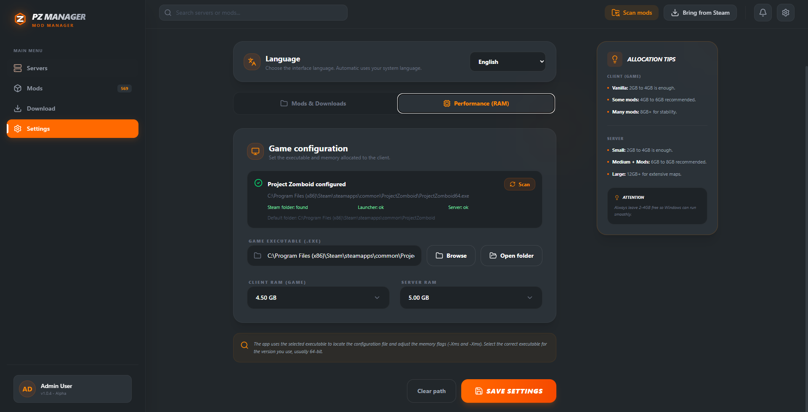
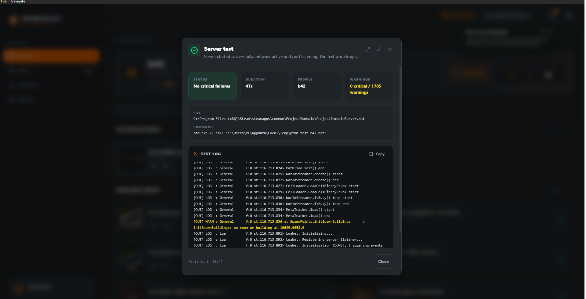
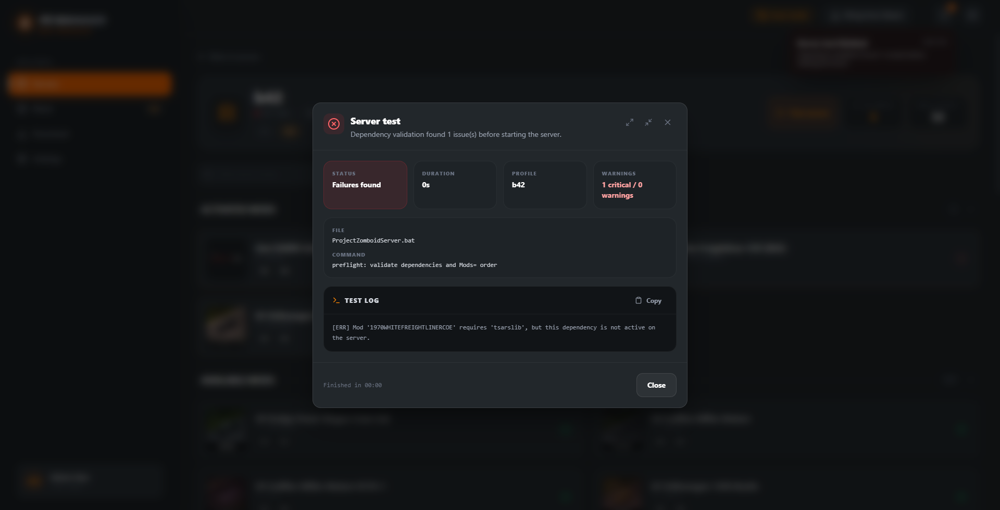

[English](README.md) | **Português (Brasil)**

<div align="center">

# PZ Manager

### Gerencie mods, downloads, configurações e servidores Linux remotos de Project Zomboid em um app desktop.

[](package.json)


</div>

---

## Sobre

O **PZ Manager** é um aplicativo desktop para operar e manter setups de mods de servidores multiplayer de **Project Zomboid** sem editar todos os arquivos do perfil manualmente.

Ele escaneia mods locais e da Steam Workshop, gerencia perfis de servidor, escreve `Mods=` e `WorkshopItems=`, valida dependências e ordem de carregamento, baixa conteúdo da Workshop com SteamCMD e controla servidores dedicados Linux remotos via SSH.

O app suporta perfis **Build 41** e **Build 42**. Cada servidor mantém sua própria build, lista de mods, itens da Workshop, configurações, logs e estado de execução.

## Destaques da versão 0.6.0

- **Banco comunitário de Workshop IDs**: sincroniza pares `Mod ID -> Workshop ID` descobertos com um serviço compartilhado, mantém cache local e mostra erro visual quando o serviço fica indisponível.
- **Ferramentas para corrigir Workshop IDs**: editar IDs pelos detalhes do mod, corrigir IDs ausentes nos mods ativos do servidor e manter `Mods=` alinhado com `WorkshopItems=`.
- **Fluxo de start remoto**: checar setup, configurar suporte Linux com systemd/FIFO, acompanhar logs de inicialização, enviar comandos de console, parar o servidor e consultar status.
- **Start com `-nosteam`**: servidores remotos agora têm um botão normal de start e outro botão `Start -nosteam`.
- **Setup remoto de SteamCMD e servidor**: instalar ou reutilizar SteamCMD, instalar ou apontar a pasta do dedicated server e configurar o helper no Linux.
- **Endurecimento da release**: CSP mais restrita para o serviço de mapeamentos, `npm audit --omit=dev` limpo, `cargo clippy` com warnings bloqueando build e testes unitários para os novos scripts de start.

## Visão Geral Das Funcionalidades

| Área | O que você pode fazer |
| --- | --- |
| **Workspaces** | Escolher um workspace local Windows ou conectar em um workspace remoto Linux via SSH com perfis de conexão salvos. |
| **Setup remoto** | Enviar/configurar o helper Linux, instalar SteamCMD, instalar ou reutilizar a pasta do dedicated server e validar os passos obrigatórios. |
| **Servidores** | Criar perfis, listar servidores existentes, pesquisar, ocultar/exibir perfis, favoritar, excluir com backup de segurança e clonar listas de mods de outro servidor. |
| **Configuração do servidor** | Editar opções comuns do `.ini`, nome/descrição pública, portas, limite de jogadores, PvP, backups, mundo e SandboxVars quando suportado. |
| **B41 e B42** | Escolher build por servidor, trocar build com confirmação, detectar mods incompatíveis e preservar layouts versionados da B42. |
| **Mods ativos** | Ativar, desativar, reordenar, paginar, filtrar, inspecionar e validar mods antes de salvar o perfil. |
| **Dependências** | Detectar dependências ausentes, proteger ordem de carregamento, instalar dependências baixadas e bloquear testes inseguros. |
| **Workshop IDs** | Resolver IDs por metadados locais, edição manual, marcadores `.pzmm-workshop-id`, cache local e banco compartilhado. |
| **Biblioteca de mods** | Escanear `Zomboid/mods`, bibliotecas da Steam Workshop, pastas remotas e diretórios personalizados com cache e miniaturas. |
| **Downloads** | Baixar itens individuais ou coleções públicas da Workshop com SteamCMD, progresso por item, cancelamento, retry de falhas e validação opcional. |
| **Fallback da Workshop** | Abrir páginas/pesquisa da Workshop quando a WebView da Steam não renderiza bem e continuar o fluxo via SteamCMD. |
| **Upload remoto de mods** | Enviar mods locais selecionados para um servidor Linux remoto e fazer deploy de um perfil local com seus mods ativos via SCP. |
| **Diagnóstico do servidor** | Rodar teste de inicialização controlado, acompanhar logs, validar portas, encontrar conflitos e parar processos conflitantes antes de tentar novamente. |
| **Controle remoto em runtime** | Iniciar normal, iniciar com `-nosteam`, monitorar startup, enviar comandos pelo canal de controle, parar com segurança e consultar status. |
| **Logs** | Navegar por logs locais ou remotos, pré-visualizar saída, filtrar linhas úteis, copiar logs e atualizar sem sair da tela do servidor. |
| **Configurações** | Configurar SteamCMD, diretórios de mods, idioma, RAM do cliente/servidor, caminhos de executáveis e concorrência de downloads. |
| **Localização** | Usar inglês ou português brasileiro com detecção automática do idioma do sistema e troca imediata. |

## Gerenciamento Remoto Linux

Workspaces remotos foram pensados para servidores dedicados Linux. Depois da conexão por SSH, o app consegue configurar um workspace gerenciado na máquina remota, enviar o helper e usar esse helper para executar comandos de gerenciamento.

Recursos remotos incluem:

- listar e editar perfis de servidor;
- escanear mods remotos e pastas da Workshop;
- instalar SteamCMD ou usar um caminho existente;
- baixar o dedicated server de Project Zomboid via SteamCMD;
- configurar templates systemd de serviço/socket para startup e entrada de comandos;
- checar firewall/setup antes de iniciar;
- iniciar normalmente ou com `-nosteam`;
- acompanhar a saída de startup via `journalctl`;
- enviar comandos de console pelo canal FIFO;
- parar com comportamento de save/quit;
- abrir terminal remoto pelo app;
- enviar mods locais ou fazer deploy de um perfil local inteiro.

O caminho `-nosteam` só muda as opções de inicialização. Firewall, logs, canal de comandos, portas, status e parada continuam iguais ao start normal.

## Banco De Workshop IDs

Perfis de servidor do Project Zomboid precisam de `Mods=` e `WorkshopItems=`, mas muitos mods instalados só expõem o Mod ID localmente. O PZ Manager mantém essas relações em um banco local de mapeamentos e pode sincronizar pares conhecidos com um serviço HTTP compartilhado.

A sincronização envia apenas pares `Mod ID -> Workshop ID`. Ela não envia perfis de servidor, arquivos de configuração, credenciais ou arquivos de mods. Se o serviço estiver fora do ar ou retornar dados inválidos, o app mostra um erro visual e continua usando o cache local.

Você também pode corrigir IDs manualmente nos detalhes do mod ou usar o assistente de Workshop IDs ausentes dentro do perfil do servidor.

## Suporte B41 E B42

Perfis antigos sem metadados abrem como **B41**. Novos perfis podem ser criados como `B41` ou `B42`, e a build pode ser alterada depois com confirmação.

Para layouts B42, o PZ Manager preserva pastas versionadas e conteúdo compartilhado em `common`:

```text
mods/
└── ExampleMod/
    ├── common/
    ├── 42/
    │   └── mod.info
    └── 42.17/
        └── mod.info
```

Ao ativar mods:

- perfis B41 escrevem o Mod ID tradicional em `Mods=`;
- perfis B42 escrevem o ID da variante compatível;
- `WorkshopItems=` mantém Workshop IDs únicos;
- mods incompatíveis continuam visíveis para revisão/remoção manual;
- o preflight bloqueia dependências ausentes, ordem inválida e mods incompatíveis antes dos testes.

## Biblioteca, Downloads E Deploy

A biblioteca é montada a partir de mods locais instalados, pastas da Steam Workshop, pastas remotas do servidor e caminhos personalizados adicionados nas Configurações. Metadados e miniaturas em cache deixam novas varreduras mais rápidas.

Downloads aceitam Workshop ID numérico ou URL da Workshop:

- item individual ou coleção pública;
- status por item e saída do SteamCMD;
- cancelamento durante o download;
- nova tentativa apenas dos itens que falharam;
- validação completa opcional;
- atualização automática da biblioteca ao finalizar.

Ao trazer um mod da Workshop para a pasta local do Zomboid, o PZ Manager copia o pacote completo e preserva variantes B41, diretórios versionados B42, conteúdo compartilhado em `common`, dependências, mapas e o marcador `.pzmm-workshop-id`.

Para servidores remotos, mods locais selecionados podem ser enviados para o host Linux. Um perfil local também pode ser empacotado e implantado com seus mods locais ativos.

## Testes Do Servidor E Logs

O teste do servidor inicia o perfil de forma controlada e mostra a saída em tempo real. Antes de iniciar, ele:

1. valida mods ativos e dependências;
2. verifica ordem de carregamento;
3. verifica compatibilidade da build;
4. valida portas configuradas;
5. informa conflitos e pode parar processos conflitantes antes de tentar de novo.

A B42 recebe um timeout maior porque pode demorar mais para inicializar.

O visualizador de logs permite navegar por arquivos de log do servidor, pré-visualizar logs locais ou remotos, destacar linhas relevantes, copiar saída e atualizar sem sair da tela de detalhes.

## Primeiros Passos

### Workspace Local

1. Abra **Configurações** e confirme os caminhos do Project Zomboid e do SteamCMD.
2. Adicione pastas de mods personalizadas se você guarda mods fora dos locais padrão.
3. Atualize a biblioteca de mods.
4. Crie ou abra um perfil de servidor.
5. Escolha a build, configure o servidor e ative os mods.
6. Corrija Workshop IDs ou dependências ausentes se o app pedir.
7. Rode um teste de inicialização antes de hospedar.

### Workspace Remoto

1. Escolha **Workspace Remoto** e conecte no servidor Linux via SSH.
2. Configure o helper remoto pelo guia de setup.
3. Instale ou selecione o SteamCMD.
4. Instale ou selecione a pasta do dedicated server de Project Zomboid.
5. Crie ou importe perfis de servidor.
6. Envie/deploye mods locais quando necessário.
7. Inicie o servidor normal ou com `-nosteam`, depois monitore logs e envie comandos pelo app.

## Interface

<p align="center">
  <a href="docs/images/server.png"></a>
  <a href="docs/images/server-detail.png"></a>
</p>

<p align="center">
  <a href="docs/images/mods.png"></a>
  <a href="docs/images/download-mod.png"></a>
</p>

<p align="center">
  <a href="docs/images/download-collection.png"></a>
  <a href="docs/images/settings.png"></a>
</p>

<p align="center">
  <a href="docs/images/performance.png"></a>
  <a href="docs/images/server-test-success.png"></a>
</p>

<p align="center">
  <a href="docs/images/server-test-error.png"></a>
</p>

## Desenvolvimento

### Pré-requisitos

- Windows 10/11 ou Linux (Ubuntu/Debian)
- [Node.js](https://nodejs.org/) v20+ ou v22+ com npm
- [Rust](https://www.rust-lang.org/tools/install) estável mais recente
- [Pré-requisitos do Tauri para Windows](https://v2.tauri.app/start/prerequisites/) ou [pré-requisitos do Tauri para Linux](https://v2.tauri.app/start/prerequisites/)
- Project Zomboid instalado para recursos locais
- Acesso SSH a um servidor Linux para recursos de workspace remoto

### Executando Localmente

```bash
npm install
npm run tauri:dev
```

Para trabalhar somente na interface:

```bash
npm run dev
```

Para gerar o build desktop e o helper do servidor Linux:

```bash
npm run tauri:build
```

### Validação

```bash
npm run build
npm audit --omit=dev
cd src-tauri
cargo test
cargo clippy --all-targets -- -D warnings
cd ..
```

## Tecnologias

| Camada | Tecnologias |
| --- | --- |
| Interface | React 19, TypeScript e Vite 8 |
| Estilos | Tailwind CSS 4 |
| Componentes e ícones | Base UI e Lucide React |
| Aplicativo desktop | Tauri 2 |
| Backend local | Rust |
| Agente do servidor remoto | Helper Rust (`pzmm-helper-linux-x86_64`) |
| Transporte remoto | SSH e SCP |
| Controle de serviço | systemd service/socket e canal FIFO no Linux |
| Downloads da Workshop | SteamCMD |
| Internacionalização | i18next, react-i18next e rust-i18n |

## Estrutura Do Projeto

```text
.
├── resources/             # Arquivos de exemplo e recursos empacotados
├── src/                   # Interface React, componentes, tipos e catálogos frontend
├── src-tauri/
│   ├── locales/           # Catálogos rust-i18n do backend
│   └── src/               # Backend Rust, helper e comandos Tauri
├── package.json           # Dependências e scripts do frontend
├── README.pt-BR.md        # Documentação em português brasileiro
└── README.md              # Documentação principal em inglês
```

## Estado Atual

O projeto está em desenvolvimento ativo. A versão 0.6.0 expande o PZ Manager de um gerenciador local de mods/perfis para uma ferramenta mais completa de operação de servidores, com gerenciamento remoto Linux, sincronização de Workshop IDs, fluxos SteamCMD, diagnósticos, logs e detecção inteligente de versão automática.

## Licença

Este repositório ainda não possui um arquivo de licença. Antes de reutilizar ou redistribuir o código, confirme os termos aplicáveis com o autor do projeto.
